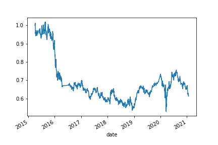
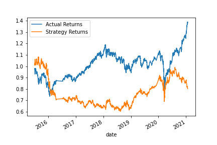
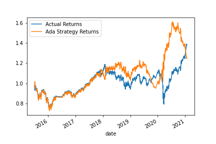

# Machine Learning Trading Bot
---

# Technologies

```python
# Imports
import pandas as pd
import numpy as np
from pathlib import Path
import hvplot.pandas
import matplotlib.pyplot as plt
from sklearn import svm
from sklearn.preprocessing import StandardScaler
from pandas.tseries.offsets import DateOffset
from sklearn.metrics import classification_report
```
---

# Evaluation and Analysis Process 

## 3 month rolling window:

1. Establish a Baseline Performance



2. Tune the Baseline Trading Algorithm: **Support Vector Machine Learning Algorithm**



3. Evaluate the New Machine Learning Classifier: **AdaBoost Boosting Alogrithm**



4. Evaluation Report

*Looking at all three plots, and comparing the two machine learning algorithms, we can see that the Adaboost does better with the training data with 94% accuracy but when utilizing the testing data it seems to underperform the SVM algorithm.* 

---

# Alternative Machine Learning Model and Strategy Returns

## 12 month rolling window:

1. What impact resulted from increasing or decreasing the training window?

    *The training window changed to 12 months actually decreased the performance of both algorithms.*

2. What impact resulted from increasing or decreasing either or both of the SMA windows?

    *By increaseing the window for both ML Algorithms, the Adaboost Algo peformed poorly compared to the SVM algorithm.*

---

# Contributors

This Analysis is brought to you by `billybishop21`

---

# License

MIT License

Copyright (c) 2021 `billybishop21`

Permission is hereby granted, free of charge, to any person obtaining a copy of this software and associated documentation files (the "Software"), to deal in the Software without restriction, including without limitation the rights to use, copy, modify, merge, publish, distribute, sublicense, and/or sell copies of the Software, and to permit persons to whom the Software is furnished to do so, subject to the following conditions:

The above copyright notice and this permission notice shall be included in all copies or substantial portions of the Software.

THE SOFTWARE IS PROVIDED "AS IS", WITHOUT WARRANTY OF ANY KIND, EXPRESS OR IMPLIED, INCLUDING BUT NOT LIMITED TO THE WARRANTIES OF MERCHANTABILITY, FITNESS FOR A PARTICULAR PURPOSE AND NONINFRINGEMENT. IN NO EVENT SHALL THE AUTHORS OR COPYRIGHT HOLDERS BE LIABLE FOR ANY CLAIM, DAMAGES OR OTHER LIABILITY, WHETHER IN AN ACTION OF CONTRACT, TORT OR OTHERWISE, ARISING FROM, OUT OF OR IN CONNECTION WITH THE SOFTWARE OR THE USE OR OTHER DEALINGS IN THE SOFTWARE.

---

